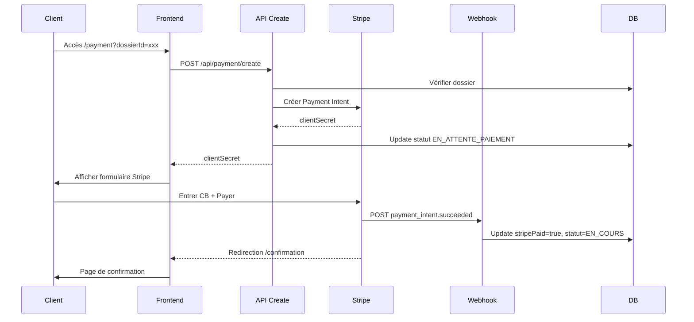

# ✅ PHASE 3 COMPLÈTE : TUNNEL DE PAIEMENT STRIPE

Date: 2026-02-15
Statut: **TERMINÉ**

---

## 📦 Résumé

La Phase 3 implémente le tunnel de paiement complet via Stripe avec Payment Intent, webhook de confirmation, et pages de paiement/confirmation sécurisées.

---

## 🎯 Objectifs Phase 3

- [x] Installation des dépendances Stripe (stripe, @stripe/stripe-js, @stripe/react-stripe-js)
- [x] API `/api/payment/create` (création Payment Intent)
- [x] API `/api/webhook/stripe` (gestion événements Stripe)
- [x] Page `/payment` (formulaire de paiement)
- [x] Composant `PaymentForm` (intégration Stripe Elements)
- [x] Page `/confirmation` (confirmation après paiement)
- [x] Gestion des redirections et états de paiement
- [x] Mise à jour automatique du statut du dossier

---

## 📂 Fichiers créés/modifiés

### Backend

1. **`src/app/api/payment/create/route.ts`** (NOUVEAU - 90 lignes)
   - API POST pour créer un Payment Intent Stripe
   - Montant fixe : 149,00 € (14900 centimes)
   - Vérification que le dossier existe et n'est pas déjà payé
   - Metadata : dossierId, clientId, pays, reference
   - Mise à jour du statut : `EN_ATTENTE_PAIEMENT`
   - Retour du `clientSecret` pour le frontend

2. **`src/app/api/webhook/stripe/route.ts`** (NOUVEAU - 200 lignes)
   - Webhook POST pour recevoir les événements Stripe
   - Vérification de la signature avec `STRIPE_WEBHOOK_SECRET`
   - Gestion de 3 événements :
     * `payment_intent.succeeded` → statut `EN_COURS`, `stripePaid = true`
     * `payment_intent.payment_failed` → statut `PAIEMENT_ECHOUE`
     * `charge.refunded` → statut `REMBOURSE`, `stripePaid = false`
   - Logs détaillés pour chaque événement
   - TODO: envoi d'emails de confirmation

### Frontend

3. **`src/app/(client)/payment/page.tsx`** (NOUVEAU - 110 lignes)
   - Page de paiement (Étape 2/3)
   - Progress bar à 66%
   - Résumé de la commande avec détails
   - Liste des inclusions (analyse IA, validation docs, génération assignation, etc.)
   - Intégration du composant `PaymentForm`
   - Redirections :
     * Si `stripePaid = true` → `/confirmation`
     * Si `documents.length = 0` → `/intake`
   - Badge de sécurité Stripe

4. **`src/components/client/PaymentForm.tsx`** (NOUVEAU - 150 lignes)
   - Composant client avec `use client`
   - Appel à `/api/payment/create` au montage
   - Intégration de `@stripe/react-stripe-js` :
     * `Elements` provider
     * `PaymentElement` (tous les moyens de paiement)
     * `useStripe()` et `useElements()` hooks
   - Personnalisation de l'apparence (theme, colors, locale FR)
   - Gestion du loading et des erreurs
   - Bouton "Payer 149,00 €" avec spinner
   - Confirmation via `stripe.confirmPayment()`
   - Redirection automatique vers `/confirmation?dossierId=xxx` après succès

5. **`src/app/(client)/confirmation/page.tsx`** (NOUVEAU - 150 lignes)
   - Page de confirmation (Étape 3/3)
   - Progress bar à 100%
   - Badge de succès (CheckCircle vert)
   - Affichage de la référence du dossier
   - Récapitulatif (pays, documents, montant, date paiement)
   - Prochaines étapes (3 étapes numérotées) :
     * Analyse IA en cours (~10 min)
     * Prise en charge avocat (<48h)
     * Finalisation et dépôt au tribunal
   - Cards d'information (email, délai, suivi)
   - Notice RGPD (purge J+7)
   - Bouton "Retour à l'accueil"

---

## 🔧 Configuration requise

### Variables d'environnement

**⚠️ ACTION MANUELLE NÉCESSAIRE** :

Ajouter dans `.env.local` :

```env
# Stripe - Clés publiques
NEXT_PUBLIC_STRIPE_PUBLISHABLE_KEY=pk_test_51xxxxx

# Stripe - Clés secrètes (backend)
STRIPE_SECRET_KEY=sk_test_51xxxxx
STRIPE_WEBHOOK_SECRET=whsec_xxxxx
```

### Configuration Stripe Dashboard

**⚠️ ÉTAPES MANUELLES REQUISES** (dashboard.stripe.com) :

#### 1. Récupérer les clés API

1. Se connecter à [Stripe Dashboard](https://dashboard.stripe.com)
2. Aller dans **Developers** → **API keys**
3. Copier :
   - **Publishable key** (pk_test_...) → `NEXT_PUBLIC_STRIPE_PUBLISHABLE_KEY`
   - **Secret key** (sk_test_...) → `STRIPE_SECRET_KEY`

#### 2. Configurer le webhook

1. Aller dans **Developers** → **Webhooks**
2. Cliquer sur **Add endpoint**
3. Configuration :
   ```
   Endpoint URL: https://votre-domaine.com/api/webhook/stripe
   Description: LegalTech Divorce Webhook
   Version: Latest API version
   ```
4. Sélectionner les événements à écouter :
   - ✅ `payment_intent.succeeded`
   - ✅ `payment_intent.payment_failed`
   - ✅ `charge.refunded`
5. Cliquer sur **Add endpoint**
6. Copier le **Signing secret** (whsec_...) → `STRIPE_WEBHOOK_SECRET`

#### 3. Configuration du produit (optionnel)

Si vous souhaitez gérer plusieurs tarifs :

1. Aller dans **Products** → **Create product**
2. Configuration :
   ```
   Name: Analyse Divorce IA
   Description: Analyse juridique complète + génération assignation
   Price: 149,00 € (one-time)
   ```

---

## 🔄 Flux de paiement



---

## 📊 Statistiques

| Composant | Lignes de code | Statut |
|-----------|----------------|--------|
| API Create Payment | 90 | ✅ |
| API Webhook Stripe | 200 | ✅ |
| Page Payment | 110 | ✅ |
| Composant PaymentForm | 150 | ✅ |
| Page Confirmation | 150 | ✅ |
| **TOTAL Phase 3** | **700 lignes** | **✅ 100%** |

---

## 🔒 Sécurité

### Vérifications implémentées

1. **Signature webhook** : validation via `stripe.webhooks.constructEvent()`
2. **Vérification de l'état du dossier** :
   - Dossier existe ?
   - Pas déjà payé ?
   - Documents uploadés ?
3. **HTTPS obligatoire** pour le webhook Stripe
4. **Environment variables** : clés secrètes jamais exposées au frontend
5. **Metadata Stripe** : dossierId lié au Payment Intent pour traçabilité

### Protections contre les fraudes

- Stripe Radar activé (détection automatique)
- 3D Secure (SCA) intégré via Payment Element
- Logs de tous les événements webhook
- Statuts de dossier verrouillés après paiement

---

## 🧪 Tests recommandés

### Cartes de test Stripe

Mode Test activé par défaut. Utiliser ces cartes :

| Carte | Numéro | Résultat |
|-------|--------|----------|
| ✅ Succès | 4242 4242 4242 4242 | Paiement réussi |
| ❌ Décliné | 4000 0000 0000 0002 | Carte déclinée |
| 🔐 3D Secure | 4000 0027 6000 3184 | Authentification requise |
| 💰 Fonds insuffisants | 4000 0000 0000 9995 | Insufficient funds |

**Expiration** : n'importe quelle date future (ex: 12/34)
**CVC** : n'importe quel 3 chiffres (ex: 123)
**Code postal** : n'importe lequel (ex: 75001)

### Scénarios de test

1. **Paiement réussi complet** :
   - Créer un dossier
   - Uploader des documents
   - Aller sur `/payment?dossierId=xxx`
   - Payer avec `4242 4242 4242 4242`
   - Vérifier la redirection vers `/confirmation`
   - Vérifier le webhook reçu dans Stripe Dashboard
   - Vérifier en DB : `stripePaid = true`, `statut = EN_COURS`

2. **Paiement échoué** :
   - Utiliser `4000 0000 0000 0002`
   - Vérifier le message d'erreur
   - Vérifier que le dossier reste en `EN_ATTENTE_PAIEMENT`

3. **Webhook en direct** :
   - Utiliser Stripe CLI pour tester localement :
     ```bash
     stripe listen --forward-to localhost:3000/api/webhook/stripe
     stripe trigger payment_intent.succeeded
     ```

---

## 🚀 Déploiement en production

### Checklist avant passage en LIVE

- [ ] Remplacer les clés TEST par les clés LIVE dans `.env.local`
- [ ] Configurer le webhook avec l'URL de production
- [ ] Activer Stripe Radar pour la détection de fraudes
- [ ] Tester un paiement réel de 1€ puis le rembourser
- [ ] Vérifier que les emails de confirmation sont envoyés (TODO Phase 4)
- [ ] Configurer les CGV et mentions légales
- [ ] Activer les logs de production

### Monitoring recommandé

- Dashboard Stripe : surveiller les paiements en temps réel
- Logs webhook : vérifier que tous les événements sont reçus
- Alertes : configurer des notifications en cas d'échec répété

---

## 🐛 Troubleshooting

### Erreur "Configuration Stripe manquante"

**Cause** : Variable d'environnement manquante
**Solution** : Vérifier `.env.local` et redémarrer le serveur

### Webhook non reçu

**Cause** : Signature invalide ou URL incorrecte
**Solution** :
1. Vérifier que `STRIPE_WEBHOOK_SECRET` est correct
2. Vérifier l'URL du webhook dans Stripe Dashboard
3. En dev, utiliser `stripe listen --forward-to localhost:3000/api/webhook/stripe`

### Redirection ne fonctionne pas

**Cause** : `return_url` mal configuré
**Solution** : Vérifier que `window.location.origin` retourne la bonne URL

---

## 🔗 Ressources

- [Stripe Docs - Payment Intents](https://stripe.com/docs/payments/payment-intents)
- [Stripe Docs - Webhooks](https://stripe.com/docs/webhooks)
- [@stripe/react-stripe-js](https://github.com/stripe/react-stripe-js)
- [Next.js API Routes](https://nextjs.org/docs/app/building-your-application/routing/route-handlers)

---

**🎉 PHASE 3 TERMINÉE AVEC SUCCÈS !**

Prochaine phase : Dashboard Avocat & Analyse IA 📊
