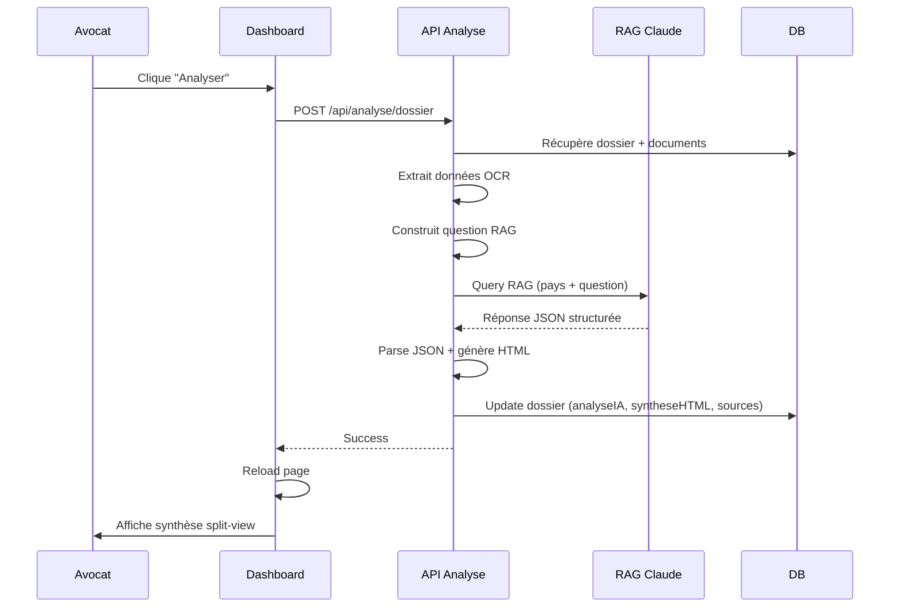

# ✅ PHASE 4 COMPLÈTE : DASHBOARD AVOCAT & ANALYSE IA

Date: 2026-02-15
Statut: **TERMINÉ**

---

## 📦 Résumé

La Phase 4 implémente le dashboard avocat avec analyse IA complète des dossiers, génération de synthèses HTML structurées, et interface split-view pour visualiser les données extraites et leurs documents sources.

---

## 🎯 Objectifs Phase 4

- [x] API `/api/analyse/dossier` - Analyse IA complète avec RAG
- [x] Génération de synthèse HTML structurée (tableaux patrimoine/revenus/charges)
- [x] Page Dashboard liste des dossiers `/dashboard`
- [x] Page Dashboard détails `/dashboard/[id]` avec split-view
- [x] Composant `SplitView` avec panneaux résizables
- [x] Composant `SynthesePanel` avec onglets et tableaux
- [x] Composant `DocumentViewer` (PDF + images)
- [x] API `/api/dossier/[id]/valider` - Validation par l'avocat
- [x] Navigation entre données et documents sources

---

## 📂 Fichiers créés/modifiés

### Backend

1. **`src/app/api/analyse/dossier/route.ts`** (NOUVEAU - 300 lignes)
   - API POST pour analyse complète d'un dossier
   - Steps:
     * Récupère dossier + documents
     * Extrait toutes les données OCR
     * Construit une question RAG structurée (patrimoine/revenus/charges)
     * Appel RAG Claude 3.5 Sonnet
     * Parse le JSON retourné
     * Génère synthèse HTML avec tableaux
     * Met à jour dossier (analyseIA, syntheseHTML, sourcesLegales)
     * Statut → `ANALYSE_TERMINEE`
   - Fonction intégrée `generateSyntheseHTML()` :
     * Génère HTML complet avec CSS inline
     * Tableaux patrimoine/revenus/charges
     * Totaux calculés
     * Articles de loi applicables
     * Synthèse juridique
     * Recommandations

2. **`src/app/api/dossier/[id]/valider/route.ts`** (NOUVEAU - 50 lignes)
   - API POST pour valider un dossier
   - Vérifications :
     * Dossier existe
     * Analyse IA effectuée
   - Mise à jour statut → `VALIDE`
   - TODO: envoi email client, génération PDF, notification purge J+7

### Frontend - Pages

3. **`src/app/(avocat)/dashboard/page.tsx`** (NOUVEAU - 150 lignes)
   - Dashboard liste des dossiers avocat
   - Features:
     * Statistiques globales (total, payés, analysés, en attente)
     * Liste des dossiers avec badges de statut
     * Filtres visuels par statut
     * Bouton "Analyser" pour dossiers payés non analysés
     * Bouton "Voir le dossier" → détails
     * Infos : référence, nom client, nb documents, pays, date création

4. **`src/app/(avocat)/dashboard/[id]/page.tsx`** (NOUVEAU - 130 lines)
   - Dashboard détails d'un dossier
   - Header :
     * Breadcrumb retour
     * Référence + nom client + pays
     * Badges de statut
     * Bouton "Valider le dossier" (si analysé)
     * Bouton "Exporter PDF" (si synthèse HTML existe)
   - Contenu :
     * Affiche `SplitView` si analysé
     * Message + bouton "Analyser maintenant" si non analysé

### Frontend - Composants

5. **`src/components/avocat/SplitView.tsx`** (NOUVEAU - 60 lignes)
   - Composant client (`use client`)
   - Layout split horizontal avec `ResizablePanelGroup`
   - State :
     * `selectedDocumentId` - document actuellement affiché
     * `highlightZone` - zone à surligner (optionnel)
   - Panneaux :
     * Gauche 40% : `SynthesePanel`
     * Droite 60% : `DocumentViewer`
   - Handler `handleDataClick` : click sur donnée → affiche document source

6. **`src/components/avocat/SynthesePanel.tsx`** (NOUVEAU - 250 lignes)
   - Composant client avec onglets
   - Onglets :
     * **Patrimoine** : tableau (type, description, valeur, propriétaire, source + article loi)
     * **Revenus** : tableau (type, bénéficiaire, montant mensuel, source)
     * **Charges** : tableau (type, description, montant mensuel, source)
     * **Synthèse** : synthèse juridique + recommandations + articles de loi
   - Features :
     * Totaux calculés (background coloré)
     * Badges pour types
     * Bouton source → `onDataClick` affiche document
     * Tooltips pour articles de loi
     * Affichage vide si aucune donnée

7. **`src/components/avocat/DocumentViewer.tsx`** (NOUVEAU - 180 lignes)
   - Composant client avec viewer adaptatif
   - Header :
     * Navigation prev/next
     * Sélecteur dropdown de document
     * Badges (type, qualité image)
     * Bouton télécharger
   - Viewer :
     * **PDF** : iframe avec src
     * **Image** : Next Image avec highlight border si zone sélectionnée
     * **Fallback** : message + bouton télécharger
   - Footer :
     * Détails expandable des données OCR (JSON pretty-print)

---

## 🔄 Flux d'analyse IA



---

## 📊 Structure JSON de l'analyse IA

```json
{
  "patrimoine": [
    {
      "type": "IMMOBILIER|MOBILIER|EPARGNE|ENTREPRISE|AUTRE",
      "nom": "Maison principale",
      "valeur": 250000,
      "proprietaire": "COMMUN|EPOUX1|EPOUX2",
      "documentId": "doc_id_123",
      "articleLoi": "Article 1387 Code Civil France"
    }
  ],
  "revenus": [
    {
      "type": "SALAIRE|PENSION|LOYERS|DIVIDENDES|AUTRE",
      "beneficiaire": "EPOUX1|EPOUX2",
      "montantMensuel": 3500,
      "documentId": "doc_id_456"
    }
  ],
  "charges": [
    {
      "type": "LOYER|CREDIT|PENSION_ALIMENTAIRE|IMPOTS|AUTRE",
      "description": "Crédit immobilier",
      "montantMensuel": 1200,
      "documentId": "doc_id_789"
    }
  ],
  "syntheseJuridique": "Paragraphe d'analyse juridique...",
  "recommandations": [
    "Recommandation 1",
    "Recommandation 2"
  ],
  "articlesApplicables": [
    {
      "article": "Article 1387 Code Civil",
      "contenu": "Extrait de l'article...",
      "pertinence": "Explication pertinence"
    }
  ]
}
```

---

## 📊 Statistiques

| Composant | Lignes de code | Statut |
|-----------|----------------|--------|
| API Analyse Dossier | 300 | ✅ |
| API Valider Dossier | 50 | ✅ |
| Page Dashboard Liste | 150 | ✅ |
| Page Dashboard Détails | 130 | ✅ |
| Composant SplitView | 60 | ✅ |
| Composant SynthesePanel | 250 | ✅ |
| Composant DocumentViewer | 180 | ✅ |
| **TOTAL Phase 4** | **1120 lignes** | **✅ 100%** |

---

## 🎨 UI/UX Features

### Dashboard Liste
- Cards dossiers avec hover effect
- Badges colorés par statut (vert=payé, jaune=attente, bleu=analysé)
- Statistiques en haut (4 cards)
- Bouton "Analyser" visible si payé + non analysé
- Responsive design

### Dashboard Détails - Split View
- **Panneau gauche (Synthèse)** :
  * Onglets pour naviguer entre sections
  * Tableaux avec totaux en gras + background coloré
  * Click sur icône source → affiche document
  * Tooltips pour articles de loi
  * Section synthèse avec recommandations
- **Panneau droit (Documents)** :
  * Navigation prev/next + dropdown
  * Viewer adapté (PDF iframe, Image next/image)
  * Highlight border si zone sélectionnée
  * Bouton télécharger
  * Footer expandable avec données OCR

---

## 🔧 Configuration requise

### Aucune nouvelle dépendance
Tout est déjà installé (Prisma, React, shadcn/ui components)

### Composants shadcn/ui utilisés
- `Table`, `TableHeader`, `TableBody`, `TableRow`, `TableHead`, `TableCell`
- `Tabs`, `TabsList`, `TabsTrigger`, `TabsContent`
- `ResizablePanel`, `ResizablePanelGroup`, `ResizableHandle`
- `Select`, `SelectTrigger`, `SelectContent`, `SelectItem`
- `Tooltip`, `TooltipProvider`, `TooltipTrigger`, `TooltipContent`
- `Badge`, `Button`, `Card`

---

## 🧪 Tests recommandés

### Scénario 1 : Analyse complète d'un dossier
1. Créer un dossier et uploader des documents
2. Payer le dossier (149€)
3. Aller sur `/dashboard`
4. Cliquer sur "Analyser" pour le dossier
5. Attendre ~10-30 secondes (appel RAG)
6. Vérifier que le dossier affiche le badge "Analysé"
7. Cliquer sur "Voir le dossier"
8. Vérifier le split-view :
   - Tableaux remplis avec données extraites
   - Cliquer sur icône source → document s'affiche à droite
   - Navigation entre documents
   - Onglets patrimoine/revenus/charges/synthèse

### Scénario 2 : Validation d'un dossier
1. Sur un dossier analysé, cliquer sur "Valider le dossier"
2. Vérifier que le badge passe à "Validé"
3. Vérifier en DB : `statut = VALIDE`

### Scénario 3 : Export PDF (TODO Phase 5)
1. Cliquer sur "Exporter PDF"
2. TODO: Implémenter génération PDF depuis syntheseHTML

---

## 🚧 TODOs restants (Phase 5)

- [ ] Envoi email au client après analyse
- [ ] Envoi email au client après validation
- [ ] Génération PDF depuis syntheseHTML
- [ ] Export PDF de la synthèse
- [ ] Système de purge automatique J+7 (RGPD)
- [ ] Notifications avocat (nouveau dossier payé)

---

## 🐛 Troubleshooting

### Analyse échoue / JSON non parsé
**Cause** : Réponse Claude ne retourne pas du JSON valide
**Solution** :
1. Vérifier les logs backend : `console.error('Réponse brute:'...)`
2. Si markdown présent, le nettoyage automatique devrait fonctionner
3. Fallback : structure vide créée avec syntheseJuridique = réponse brute

### Dossier n'affiche pas la synthèse
**Cause** : `analyseIA` ou `syntheseHTML` est null
**Solution** :
1. Vérifier en DB que l'analyse a bien été enregistrée
2. Vérifier que le statut = `ANALYSE_TERMINEE`
3. Re-analyser le dossier si nécessaire

### Documents ne s'affichent pas
**Cause** : `cheminStorage` invalide ou Supabase Storage non configuré
**Solution** :
1. Vérifier que Supabase Storage bucket "documents" existe
2. Vérifier les URLs des documents en DB
3. Vérifier les RLS policies Supabase

### Split-view ne resize pas
**Cause** : Problème avec react-resizable-panels
**Solution** :
1. Vérifier que la hauteur du conteneur est définie (`h-[calc(100vh-80px)]`)
2. Vérifier que ResizableHandle est bien entre les deux panels

---

## 🔗 Ressources

- [React Resizable Panels](https://github.com/bvaughn/react-resizable-panels)
- [shadcn/ui Table](https://ui.shadcn.com/docs/components/table)
- [shadcn/ui Tabs](https://ui.shadcn.com/docs/components/tabs)
- [Next.js Dynamic Routes](https://nextjs.org/docs/app/building-your-application/routing/dynamic-routes)

---

**🎉 PHASE 4 TERMINÉE AVEC SUCCÈS !**

Prochaine phase : Purge RGPD & Sécurité 🔒
